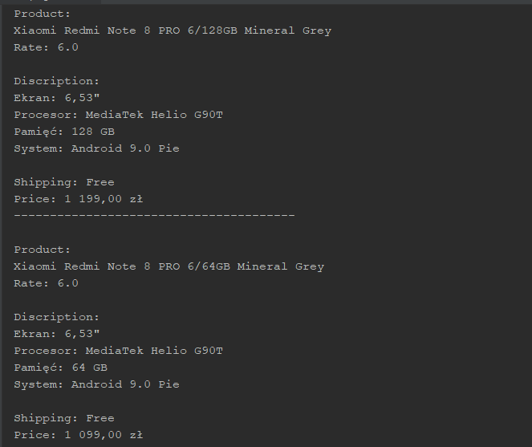
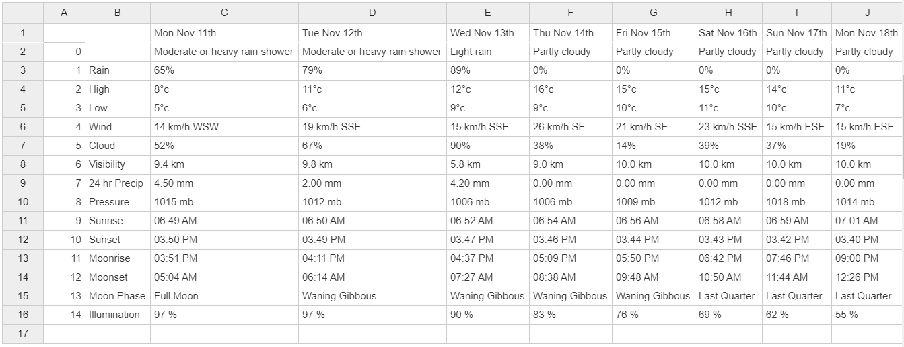

# Scraping

### Scraping x-kom
Retrieves phones and selected parameters from multiple pages.

###### Features
- Python
- BeautifulSoup

### Warsaw weather for 10 days
Shows weather with all parameters for 10 days.
Saves in CSV file.

###### Features
- Python
- BeautifulSoup
- Pandas

